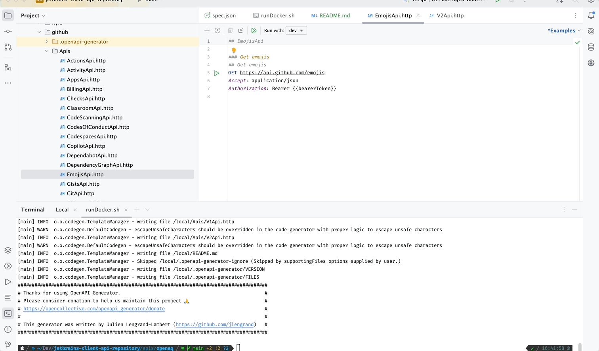
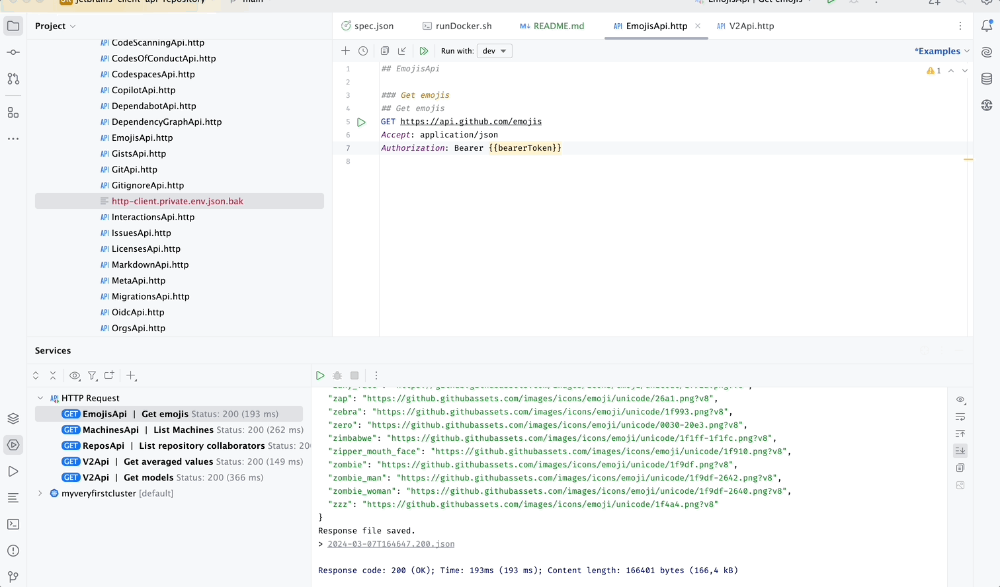

# Jetbrains Client API directory

This repository is a collection of [OpenAPI](https://swagger.io/specification/) specification files that have been converted into the [Jetbrains HTTP Client](https://www.jetbrains.com/help/idea/http-client-reference.html) format and are ready for use.
It's basically Postman, within IntelliJ, ready for you to use.

Each folder contains a different API. To use them, open them up in [IntelliJ](https://www.jetbrains.com/idea/), and run them 😊.

## APIs

* [GitHub](/apis/github/README.md)
* [Fly.io](/apis/flyio/README.md)
* [OpenAQ](/apis/openaq/README.md)

## Authenticated calls and parameters

* In the files, you will find values looking like this ``{{parameter}}``. Those parameters can be set using an environment file.
* In many cases, an API Key is also required. The method is the same.
* Set the environment you want to run the query in, and run the query!

_Note: Never upload your private environment files with your API Keys. They should be ignored by default._

## Author

* [Julien Lengrand-Lambert](https://github.com/jlengrand)